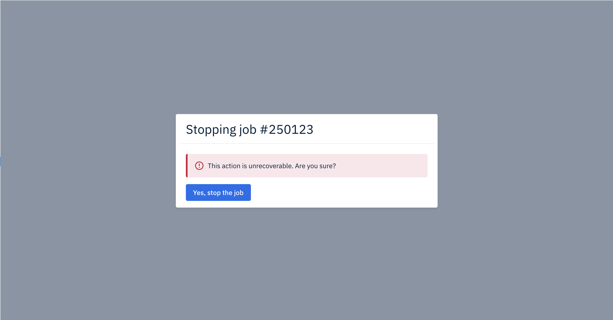

The goal of the Nulogy Design System is to be able to build entire interfaces exclusively out of NDS components and the properties they expose. This ensures we're building centralized, consistent and themeable interfaces. We've made great progress towards this goal over the past few years but it's expected that you'll still find gaps in the system, especially as new experiences are designed. For these, we provide building blocks for generating custom components.

Read on to learn about the different types of NDS components and how they can best be leveraged in your application.

## High Level Components

These are the components you'd come to expect from a design system, like [Buttons](/components/buttons), [Inputs](/components/input), and [Alerts](/components/alert). They are designed to look and behave a certain way and their appearance is intentional. There are matching versions of these components inside the Figma UI kit. All high level components have properties for changing the margins so they can be placed next to each other without creating new instances.

Here's an example of composing some high level components together for a simple view:



```jsx
<Modal title="Stopping job #250123">
  <Alert type="danger" mb="x2">
    This action is unrecoverable. Are you sure?
  </Alert>
  <PrimaryButton>Yes, stop the job</PrimaryButton>
</Modal>
```

If you find yourself tempted to override styles on one of these components, there's a high likelihood that you've discovered a new component that should be built up out of building blocks instead.

## Building Blocks

We expose building blocks to create custom, one-off or experimental experiences while still utilizing Nulogy's theme and design language. These are small [styled-components](https://styled-components.com/) that can be composed together to create anything in Nulogy's style. These are:

- [Box](/components/box)
- [Flex](/components/flex)
- [Link](/components/link)
- [List](/components/list)
- [Text](/components/text)

Each of these components create exactly one element in the DOM, and have properties exposed for changing their visual styles. This eliminates the need to create redundant components and guarantees that their styles can be themed for different use cases in the future. For more details, see the documentation page for each component.

### The "as" prop

Since our building blocks are styled-components, they come with the ["as"](https://styled-components.com/docs/api#as-polymorphic-prop) property. This allows you to change the element rendered on the page, while keeping existing styling and props.

For example, to use the Box component to create a table cell instead of the default div:

```
<Box as="td" m="x1" color="darkGrey" />
```

### Responsive styles

All building blocks can be styled responsively, allowing different experiences for different devices.

For example, to change the size and background colour based on screen size:

```
<Box
    width={{ extraSmall: "100%", small: "250px", medium: "800px"}}
    bg={{ extraSmall: "blue", small: "darkBlue", medium: "blackBlue" } }
/>
```

### The theme

All of the design values are stored in one place called our theme. When changing a style property on a component, the theme will be checked first.

For example, to create a blue Box with white text and 24px of padding you can use:

```
<Box bg="darkBlue" color="white" p="x3">Box</Box>
```

The `darkBlue`, `white`, and `x3` are all pulled from the appropriate object in the theme file. This helps us stay scalable as we can now change what "darkBlue" is to Nulogy and propogate that change across our applications.

For more information on the theme, see the [theme](/theme) documentation or an individual building block's API documentation.
