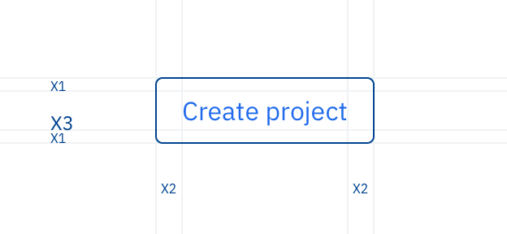

import { Box, Flex, Text, theme } from "@nulogy/components";
import { COPY_WIDTH } from "../../components/CONSTANTS";

# Spacing

A spacing scale is used to maintain consistent paddings between and within elements throughout our products. Sticking to a scale allows us to be more consistent and predictable, and makes our designs more harmonious.

## Scale

Nulogy uses a scale based on **8px** with modifiers from half (4px) to 8x (64px).

<Flex maxWidth={COPY_WIDTH} m="0 auto" justifyContent="space-between">
  <Box>
    <Flex height="64px" verticalAlign="bottom" alignItems="flex-end">
      <Box
        bg="lightBlue"
        mx="auto"
        mb="x2"
        height={theme.space.half}
        width={theme.space.half}
      />
    </Flex>
    <Text
      textAlign="center"
      fontSize={{ extraSmall: "small", medium: "medium" }}
      mb="half"
    >
      {theme.space.half}
    </Text>
    <Text textAlign="center" fontSize="small">
      half
    </Text>
  </Box>
  <Box>
    <Flex height="64px" verticalAlign="bottom" alignItems="flex-end">
      <Box
        bg="lightBlue"
        mx="auto"
        mb="x2"
        height={theme.space.x1}
        width={theme.space.x1}
      />
    </Flex>
    <Text
      textAlign="center"
      fontSize={{ extraSmall: "small", medium: "medium" }}
      mb="half"
    >
      {theme.space.x1}
    </Text>
    <Text textAlign="center" fontSize="small">
      x1
    </Text>
  </Box>
  <Box>
    <Flex height="64px" verticalAlign="bottom" alignItems="flex-end">
      <Box
        bg="lightBlue"
        mx="auto"
        mb="x2"
        height={theme.space.x2}
        width={theme.space.x2}
      />
    </Flex>
    <Text
      textAlign="center"
      fontSize={{ extraSmall: "small", medium: "medium" }}
      mb="half"
    >
      {theme.space.x2}
    </Text>
    <Text textAlign="center" fontSize="small">
      x2
    </Text>
  </Box>
  <Box>
    <Flex height="64px" verticalAlign="bottom" alignItems="flex-end">
      <Box
        bg="lightBlue"
        mx="auto"
        mb="x2"
        height={theme.space.x3}
        width={theme.space.x3}
      />
    </Flex>
    <Text
      textAlign="center"
      fontSize={{ extraSmall: "small", medium: "medium" }}
      mb="half"
    >
      {theme.space.x3}
    </Text>
    <Text textAlign="center" fontSize="small">
      x3
    </Text>
  </Box>
  <Box>
    <Flex height="64px" verticalAlign="bottom" alignItems="flex-end">
      <Box
        bg="lightBlue"
        mx="auto"
        mb="x2"
        height={theme.space.x4}
        width={theme.space.x4}
      />
    </Flex>
    <Text
      textAlign="center"
      fontSize={{ extraSmall: "small", medium: "medium" }}
      mb="half"
    >
      {theme.space.x4}
    </Text>
    <Text textAlign="center" fontSize="small">
      x4
    </Text>
  </Box>
  <Box>
    <Flex height="64px" verticalAlign="bottom" alignItems="flex-end">
      <Box
        bg="lightBlue"
        mx="auto"
        mb="x2"
        height={theme.space.x5}
        width={theme.space.x5}
      />
    </Flex>
    <Text
      textAlign="center"
      fontSize={{ extraSmall: "small", medium: "medium" }}
      mb="half"
    >
      {theme.space.x5}
    </Text>
    <Text textAlign="center" fontSize="small">
      x5
    </Text>
  </Box>
  <Box>
    <Flex height="64px" verticalAlign="bottom" alignItems="flex-end">
      <Box
        bg="lightBlue"
        mx="auto"
        mb="x2"
        height={theme.space.x6}
        width={theme.space.x6}
      />
    </Flex>
    <Text
      textAlign="center"
      fontSize={{ extraSmall: "small", medium: "medium" }}
      mb="half"
    >
      {theme.space.x6}
    </Text>
    <Text textAlign="center" fontSize="small">
      x6
    </Text>
  </Box>
  <Box>
    <Flex height="64px" verticalAlign="bottom" alignItems="flex-end">
      <Box
        bg="lightBlue"
        mx="auto"
        mb="x2"
        height={theme.space.x8}
        width={theme.space.x8}
      />
    </Flex>
    <Text
      textAlign="center"
      fontSize={{ extraSmall: "small", medium: "medium" }}
      mb="half"
    >
      {theme.space.x8}
    </Text>
    <Text textAlign="center" fontSize="small">
      x8
    </Text>
  </Box>
</Flex>

## Example

<Box maxWidth={COPY_WIDTH} m="0 auto">
  
</Box>

## How to choose spacing

There are two important factors to consider when choosing spacing: size and relatedness

- Use less spacing inside smaller elements or between functionally related elements.
- Use more spacing inside larger elements or between less functionally related elements

_Note: half should mostly be used for spacing related items within an element, e.g a button’s text and it’s icon._
