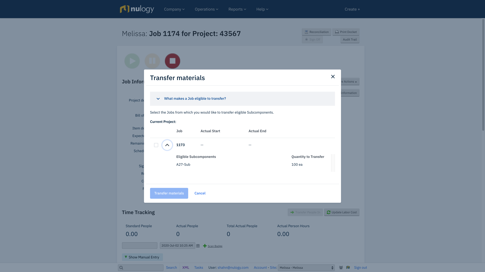

# Using NDS in Operational Solution Core

The Design System is primarily designed to be used in our newer applications and modules. These have large fonts and a more modern look and feel. The design system can still be used in our legacy applications, but there are some differences and things to be aware of.

## Font Size

The default body font size in NDS is 16px. Due to layout limitations in Ops Core, we can’t use a default font that large. If you use an NDS component inside of Ops Core, the NDSProvider needs to override the “medium” font size will from 16px to 14px. An example of this being done can be found [here](https://github.com/nulogy/PackManager/blob/main/client_webpack/warehouse_management/src/lib/NDSProvider.tsx).

## Style Overrides

There are cases where you may be modernizing an older part of the application and want to use our new React-based technologies but still keep the UI looking the same. Since our components are built using styled components, they can be overriden using our theme and standard CSS references. An example of this can be found [here](https://github.com/nulogy/PackManager/blob/main/packages/components/src/LegacyPagination.tsx).

<Alert>
  We don’t want to propogate this pattern too much, as we’d rather update the
  look-and-feel of older modules. Currently, we only have legacy-styled Tables
  and Pagination. If you’re about to make drastic style changes to a component,
  please reach out for a consultation with Design Ops first.
</Alert>
