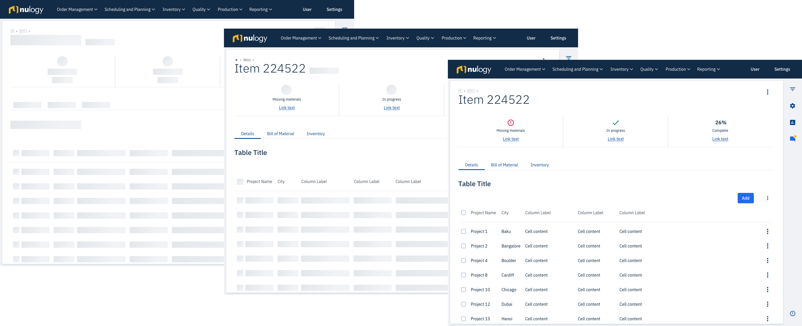

import {
  Box,
  Button,
  Flex,
  Icon,
  Text,
  LoadingAnimation,
} from "@nulogy/components";
import { CODE_WIDTH, COPY_WIDTH } from "../../components/CONSTANTS";

# Loading content

Loading patterns are used when a user’s action causes a delay in the system’s response. A successful loading indicator provides timely feedback on the progress of the user’s request and creates an illusion of time going by faster.

<Box width="100%" textAlign="center" my="x8">
  <LoadingAnimation />
</Box>

Nulogy Design System provides a range of loading methods to match various situations.

## Skeleton screens (progressive loading)

The skeleton screens deliver information in increments as they are becoming available, making the loading experience fluid and seamless. The skeleton screens are used for page or section loads and typically complete within 5 seconds, even though the duration of 10 seconds is acceptable. For delays over 10 seconds, other methods that provide more feedback should be considered.

## Full-screen loading

The full-screen method is used when an action temporarily disables the application for more than 2 seconds. There are 2 types of full-screen loaders: **Indeterminate** and **Determinate**.

The indeterminate loading method is used for actions that can't be estimated, unlike determinate loading which is used for actions that can be estimated.

For delays between 2 and 5 seconds the animation is sufficient, while for delays over 5 seconds the animation should be accompanied with the appropriate combination of information and actions. If the action takes longer than expected to execute, a warning with options to retry or abort should be displayed.

<Flex width="100%" maxWidth={CODE_WIDTH} mt="x8" mb="x6" mx="auto">
  <Box width="240px" mx="auto">
    <Text mb="x1" textAlign="right" mr="x3" fontWeight="medium">
      2/4
    </Text>
    <LoadingAnimation />
    <Box mt="x1" mx="x3">
      <Flex justifyContent="space-between" mb="half">
        <Text m="0" fontSize="small" color="darkGrey">
          Data loaded
        </Text>
        <Icon icon="check" color="green" height="20px" />
      </Flex>
      <Flex justifyContent="space-between" mb="half">
        <Text m="0" fontSize="small" fontWeight="medium">
          Applying status ...
        </Text>
      </Flex>
      <Flex justifyContent="space-between" mb="half">
        <Text m="0" fontSize="small" color="darkGrey">
          Change price
        </Text>
      </Flex>
      <Flex justifyContent="space-between" mb="half">
        <Text m="0" fontSize="small" color="darkGrey">
          Update status
        </Text>
      </Flex>
    </Box>
    <Flex justifyContent="center" mt="x8">
      <Icon color="grey" icon="refresh" size="40px" mr="x1" p="x1" />
      <Icon color="darkGrey" icon="close" size="40px" p="x1" />
    </Flex>
  </Box>
  <Box width="360px" mx="auto">
    <Text
      mb="half"
      mt="x2"
      textAlign="right"
      color="darkGrey"
      fontSize="smaller"
    >
      about <strong>21 sec.</strong> left
    </Text>
    <Box
      height="8px"
      width="100%"
      bg="lightGrey"
      mt="x1"
      mb="x2"
      position="relative"
    >
      <Box
        position="absolute"
        top="0"
        left="0"
        width="100px"
        height="8px"
        bg="blue"
      />
    </Box>
    <Box mt="x1">
      <Flex justifyContent="space-between" mb="half">
        <Text m="0" fontSize="small" color="darkGrey">
          Data loaded
        </Text>
        <Icon icon="check" color="green" height="20px" />
      </Flex>
      <Flex justifyContent="space-between" mb="half">
        <Text m="0" fontSize="small" fontWeight="medium">
          Applying status ...
        </Text>
      </Flex>
      <Flex justifyContent="space-between" mb="half">
        <Text m="0" fontSize="small" color="darkGrey">
          Change price
        </Text>
      </Flex>
      <Flex justifyContent="space-between" mb="half">
        <Text m="0" fontSize="small" color="darkGrey">
          Update status
        </Text>
      </Flex>
    </Box>
    <Flex justifyContent="center" mt="x8">
      <Icon color="grey" icon="refresh" size="40px" mr="x1" p="x1" />
      <Icon color="darkGrey" icon="close" size="40px" p="x1" />
    </Flex>
  </Box>
</Flex>
<Text fontSize="small" color="darkGrey" textAlign="center" mt="x2">
  Example of indeterminate (left) and determinate (right) loading pattern with
  task/time counter, task list, and controls
</Text>

## Progress widget

A progress Widget is used for actions that take at least 5 seconds and that do not need to be completed before another action can be performed. In this method, the progress bar is displayed in a modal window that can be minimized. There can be multiple modal windows active at the same time.

<Flex
  mt="x8"
  mb="x6"
  width="100%"
  maxWidth={CODE_WIDTH}
  mx="auto"
  justifyContent="space-between"
  alignItems="flex-end"
>
  <Box
    width="360px"
    borderRadius="medium"
    boxShadow="large"
    pt="half"
    pr="x2"
    pb="x2"
    pl="x2"
  >
    <Flex justifyContent="flex-end" position="relative" left="x1">
      <Icon color="grey" icon="refresh" size="40px" mr="half" mb="x4" p="x1" />
      <Icon color="darkGrey" icon="close" size="40px" mr="half" p="x1" />
      <Icon color="darkGrey" icon="minimize" size="40px" p="x1" />
    </Flex>
    <Flex justifyContent="space-between" mb="half" alignItems="flex-end">
      <Text fontWeight="bold" m="0">
        Updating records
      </Text>
      <Text color="darkGrey" m="0" pb="half" fontSize="smaller">
        about <strong>21 sec.</strong> left
      </Text>
    </Flex>
    <Box
      height="8px"
      width="100%"
      bg="lightGrey"
      mt="x1"
      mb="x2"
      position="relative"
    >
      <Box
        position="absolute"
        top="0"
        left="0"
        width="100px"
        height="8px"
        bg="blue"
      />
    </Box>
    <Box mt="x1">
      <Flex justifyContent="space-between" mb="half">
        <Text m="0" fontSize="small" color="darkGrey">
          Data loaded
        </Text>
        <Icon icon="check" color="green" height="20px" />
      </Flex>
      <Flex justifyContent="space-between" mb="half">
        <Text m="0" fontSize="small" fontWeight="medium">
          Applying status ...
        </Text>
      </Flex>
      <Flex justifyContent="space-between" mb="half">
        <Text m="0" fontSize="small" color="darkGrey">
          Change price
        </Text>
      </Flex>
      <Flex justifyContent="space-between" mb="half">
        <Text m="0" fontSize="small" color="darkGrey">
          Update status
        </Text>
      </Flex>
    </Box>
  </Box>
  <Flex
    height="56px"
    borderRadius="medium"
    boxShadow="medium"
    alignItems="center"
    py="half"
    px="x2"
  >
    <Flex alignItems="center">
      <Text m="0" mr="x2">
        Updating rec...
      </Text>
      <Text color="darkGrey" m="0" mr="half" pt="half" fontSize="smaller">
        <strong>21</strong> sec.
      </Text>
    </Flex>
    <Box position="relative" left="x1" height="40px">
      <Icon color="darkGrey" icon="more" size="40px" mr="half" p="x1" />
      <Icon color="darkGrey" icon="maximize" size="40px" p="x1" />
    </Box>
  </Flex>
</Flex>
<Text fontSize="small" color="darkGrey" textAlign="center" mt="x2">
  Example of maximized (left) and minimized (right) progress widget
</Text>

## Inline loading

This method is should be avoided whenever possible since it provides an inferior user experience and adds additional technical complexity. This method should only be considered in combination with skeleton screens (when they are applied on a section of the page) and in legacy applications where this method is established as a standard. This method is used for actions that take between 2 and 10 seconds to execute.

<Flex
  maxWidth={COPY_WIDTH}
  m="0 auto"
  justifyContent="space-around"
  alignItems="center"
>
  <Button>Apply status</Button>
  <Flex alignItems="center" mt="x4" mb="x4">
    <Text m="0" mr="x1" color="darlGrey">
      Applying status
    </Text>
    <Icon icon="loading" />
  </Flex>
  <Flex alignItems="center">
    <Icon icon="check" color="green" mr="x1" />
    <Text m="0" color="darlGrey">
      Status applied
    </Text>
  </Flex>
</Flex>
<Text fontSize="small" color="darkGrey" textAlign="center" mt="x2">
  Button example of inline loading
</Text>
